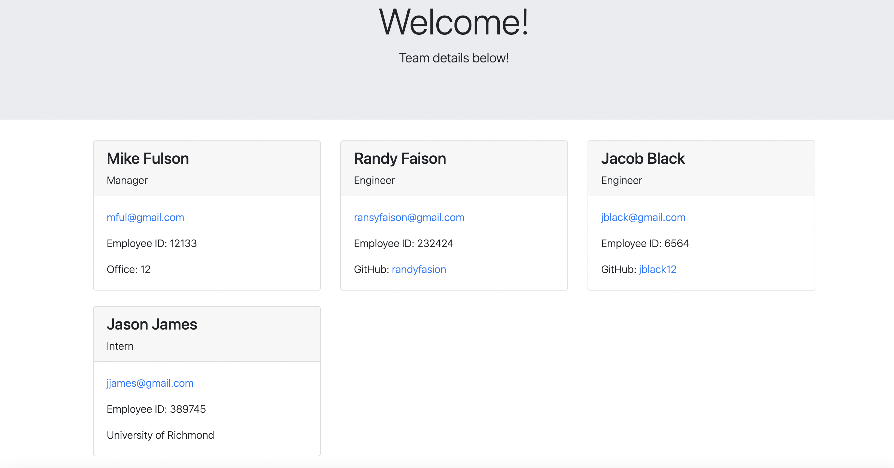

# 10 Object-Oriented Programming: Team Profile Generator

## Description

This application take in information about a team at a Software Engineering company. It then generates an HTML page to display all the information that was inputed about the team. Also, all four of the class modules (employee, intern, manager, and engineer) are tested using Jest. 

Since this application is not deployed. Here is a link to a walkthrough video that demostrates its functionality and all of the tests. 

## Mock-Up

The following image shows a mock-up of the generated HTML’s appearance and functionality:

Video link:

Link to Github Repository:

https://github.com/randyfasion/Team-Profile-Generator

Link to Index.html
